# rode_rm.py — Script Flowchart

```mermaid
flowchart TD
    START([Start]) --> ARGS[Parse CLI arguments]

    ARGS --> APPS{--from-file?}
    APPS -- Yes --> FILE[read_apps_from_file\nappids.txt or --appfile]
    APPS -- No  --> SINGLE["apps = [(app_name, apmid)]"]
    FILE    --> VAL
    SINGLE  --> VAL

    subgraph VAL[Validate]
        direction TB
        V2[ELK Nonprod URL + creds required]
        V4[ELK Prod URL + creds required]
        V7[Workspace required]
        V1[All skipped if --skip-elk / --skip-cribl]
    end

    VAL --> VALERR{Errors?}
    VALERR -- Yes --> DIE1([Exit with error])
    VALERR -- No  --> TMPL

    TMPL["save_templates (always runs)\nWrite 4 JSON files per app →\nops_rm_r_templates_output/\n· roles_{apmid}.json\n· role_mappings_{apmid}.json\n· roles_{apmid}_pushable.json\n· role_mappings_{apmid}_pushable.json"] --> CONFIRM

    CONFIRM{"--yes or\n--dry-run?"} -- No  --> PROMPT[Prompt: type YES]
    CONFIRM -- Yes --> SESSIONS
    PROMPT --> PCONF{Confirmed?}
    PCONF -- No  --> DIE2([Exit: aborted])
    PCONF -- Yes --> SESSIONS

    SESSIONS["Build ELK sessions\n─────────────────────\nNonprod: session + headers\nProd:    session + headers"] --> ORDER

    ORDER{--order} -- elk-first   --> ELK
    ORDER          -- cribl-first --> CRIBL2

    subgraph ELK[run_elk]
        direction TB
        ES{--skip-elk?}
        ES -- Yes --> ELKSKIP([ELK skipped])
        ES -- No  --> ELKLOOP

        subgraph ELKLOOP["For each app × 4 configs (test-onshore, test-offshore, prod-onshore, prod-offshore)"]
            direction TB
            ENVCHECK{"environment\n== prod?"}
            ENVCHECK -- Yes --> USEPROD[Prod URL + Prod session]
            ENVCHECK -- No  --> USENP[Nonprod URL + Nonprod session]
            USEPROD --> GEN
            USENP   --> GEN
            GEN[generate_templates\nPUSER + USER\nrole + role_mapping] --> DR1{--dry-run?}
            DR1 -- Yes --> DRL1[Log DRY-RUN PUT x4]
            DR1 -- No  --> ELPUT[PUT role_PUSER\nPUT role_USER\nPUT rm_PUSER\nPUT rm_USER]
            ELPUT --> PUTRES{200/201?}
            PUTRES -- Yes --> PUTOK[Log OK]
            PUTRES -- No  --> PUTERR[Log ERR, ok=False]
        end
    end

    subgraph CRIBL[run_cribl → push_cribl]
        direction TB
        CS{--skip-cribl?}
        CS -- Yes --> CRSKIP([Cribl skipped])
        CS -- No  --> LOADCFG[Load config.json\nGet workspace config]
        LOADCFG --> URLRES["Resolve URLs\nroot_url + api_base\n(override if --cribl-url)"]
        URLRES --> AUTHCK{token?}
        AUTHCK -- No  --> LOGINAPI[POST /api/v1/auth/login]
        AUTHCK -- Yes --> GR
        LOGINAPI --> GR
        GR["GET /routes/{table}\nGET /system/outputs"] --> SMIN{"total_routes\n≥ min_routes?"}
        SMIN -- No  --> DIED3([Exit: safety check])
        SMIN -- Yes --> ALOOP

        subgraph ALOOP[For each app]
            direction TB
            BLDROUTE[Build route object\nid / filter / output / name]
            BLDROUTE --> DUPCHK{"name or filter\nalready exists\nor seen this batch?"}
            DUPCHK -- Yes --> RSKIP[Skip route\nlog SKIP]
            DUPCHK -- No  --> ADDRT[Append to new_routes\nAdd to tracking sets]
            ADDRT --> DCHK{"dest_id already\nexists?"}
            DCHK -- Yes --> DSKIP[Skip dest\nlog SKIP]
            DCHK -- No  --> ADDDST[Append to new_dests]
        end

        ALOOP --> SAFTER{"total_after\n≥ total_before?"}
        SAFTER -- No  --> DIED4([Exit: safety check])
        SAFTER -- Yes --> DR2{--dry-run?}
        DR2 -- Yes --> DRL2[Log DRY-RUN\nCribl writes skipped]
        DR2 -- No  --> SNAP

        SNAP[Write snapshot JSON\ncribl_snapshots/workspace/\nnow_stamp.json] --> POSTCR

        POSTCR["POST each new dest\nto /system/outputs"] --> POSTCK{200/201?}
        POSTCK -- No  --> DIED5([Exit: dest create failed])
        POSTCK -- Yes --> PCHK{"new_routes\nexist?"}
        PCHK -- No  --> NOOP[Log: no route changes]
        PCHK -- Yes --> PTCH["PATCH /routes/{table}\nunwrapped payload"]
        PTCH --> PTCHCK{200/204?}
        PTCHCK -- No  --> DIED6([Exit: PATCH failed])
        PTCHCK -- Yes --> PLOG[Log OK\n+ rollback path]
    end

    ELK    --> CRIBL
    CRIBL2 --> CRIBL3[run_cribl]
    CRIBL3 --> ELK2[run_elk]
    ELK2   --> DONE

    CRIBL  --> DONE([Done ✓])
```

---

## Summary table

| Step | Always runs | Description |
|------|:-----------:|-------------|
| Parse args | ✓ | Single app (`--app_name`/`--apmid`) or bulk (`--from-file --appfile`) |
| Validate | ✓ | URLs, credentials, workspace — skipped per `--skip-elk`/`--skip-cribl` |
| Save templates | ✓ | 4 JSON files per app written to `ops_rm_r_templates_output/` |
| Confirm | ✓ | Auto-confirmed with `--yes` or `--dry-run` |
| Build ELK sessions | ✓ | Separate session + headers for nonprod and prod |
| `run_elk` | if not `--skip-elk` | PUT roles + role-mappings to correct cluster by environment |
| `run_cribl` | if not `--skip-cribl` | GET → plan → snapshot → POST dests → PATCH routes |

## ELK environment routing

| Config block | Cluster |
|---|---|
| `test` onshore + offshore | `--elk-url` nonprod |
| `prod` onshore + offshore | `--elk-url-prod` prod |

## Cribl safety gates

| Gate | Prevents |
|---|---|
| `total_before ≥ min_routes` | Running against an empty / broken config |
| `total_after ≥ total_before` | Accidentally deleting existing routes |
| Duplicate name/filter check (includes within-batch) | Adding the same route twice |
| Snapshot written before any write | Provides rollback point |
